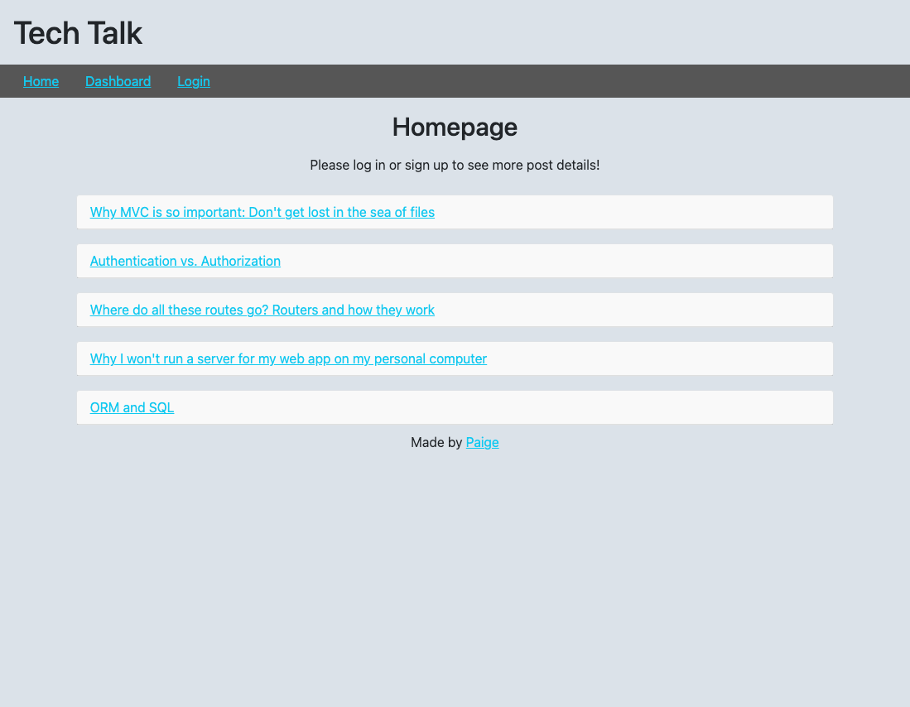
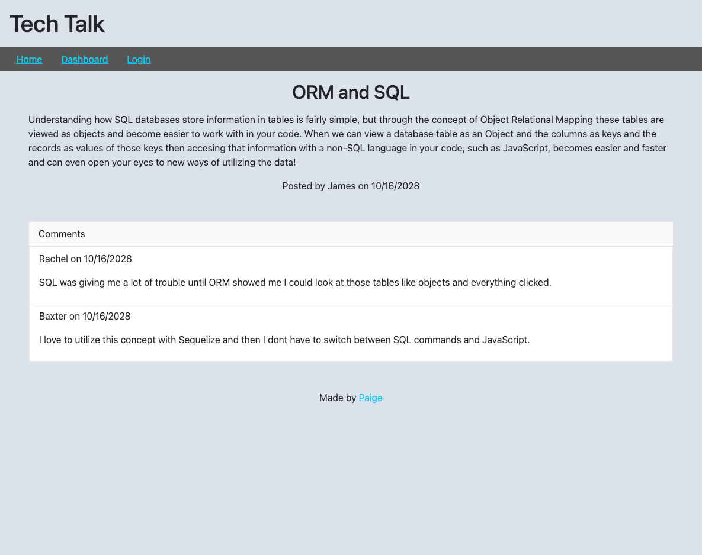
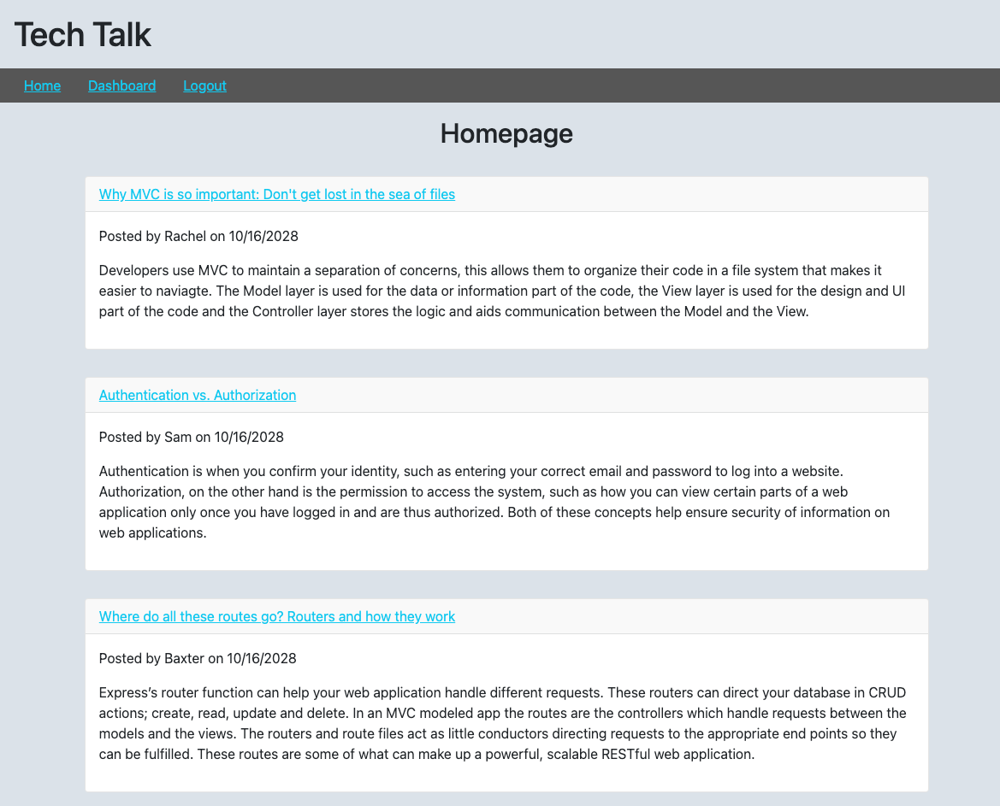
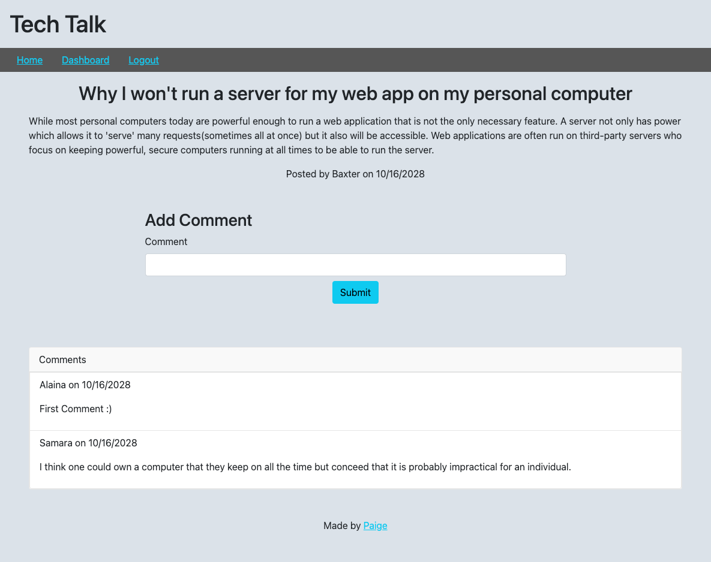
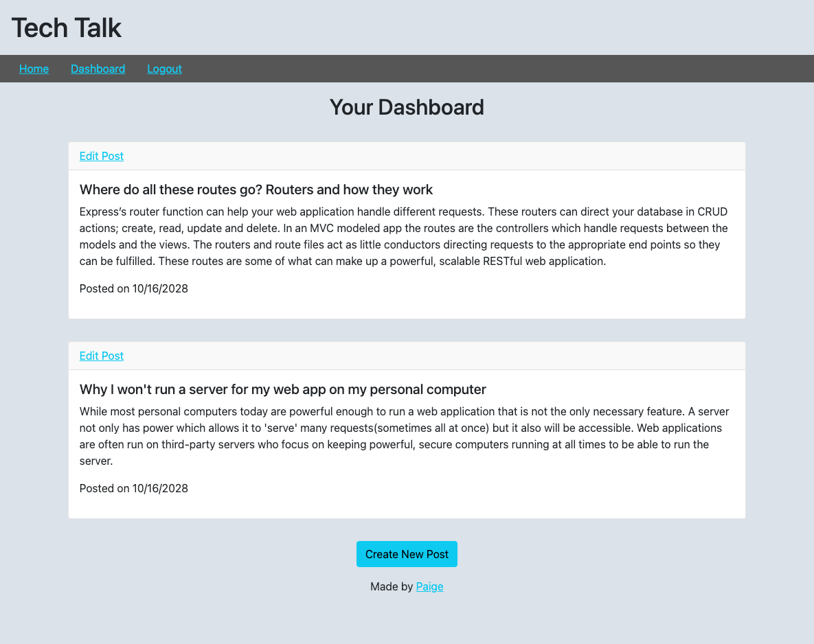
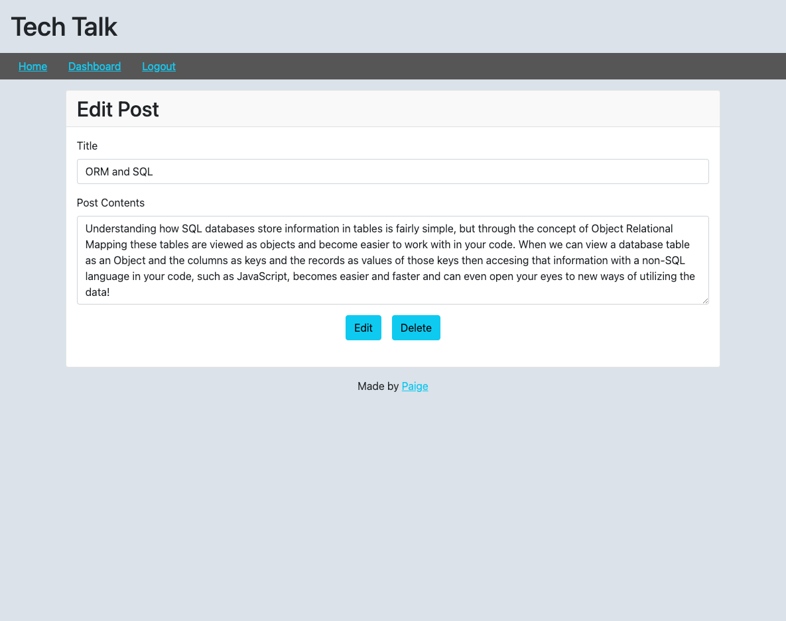

# Tech Talk: A little comp-sci blog

## Descripton

This web application is a CMS-style blog that utilizes the Model-View-Controller software design pattern. The blog allows users to create an account, log in, share posts and view and comment on other user's posts. This application served to familiarize me with MVC design as well as the Handlebars.js template system to generate the the webpage templates. This web application also employs the Express.js Node framework and uses a MySQL database powered by Sequelize and Javascript.

## Table of Contents

- [Installation](#installation)
- [Usage](#usage)
- [Credits](#credits)
- [License](#license)

## Installation

To run this application, first download the repository and open in your preferred code editor. Run `npm install` to download the necessary npm package dependencies. These dependencies can be found listed in the package.json file.

Before entering your MySQL shell you will need to create your own dotenv file with the following information:

    DB_NAME: 'blog_db'
    DB_USER: '(your MySQL username)'
    DB_PASSWORD: '(your MySQL password)'
    SESSION_SECRET='(the session secret)'

This is necessary to be able to connect to the database while also keeping your private information separate from the code.

In your MySQL shell create the database locally by running `source db/schema.sql` this will also initiate use of the database as the schema.sql file also contains the code to focus on the correct database; `USE (database)_db`.

After closing the MySQL shell, navigate to the main repository in the command line and run `npm run seed` to seed the database and then run `npm run start` to initialize the application.

## Usage

The deployed site can be viewed [here](https://comp-tech-talk-1c5888367981.herokuapp.com/). The homepage displays previously created blog posts and users can click on the title of the blog post to view the post content and the creator of the post.

Once a user creates an account and/or logs in they can view the usernames of the creator of each post and after clicking on a post have the option to leave a comment.

A logged in user can click the Dashboard button to view their own blog posts. Each post has a link where the user can edit or delete their own posts. On the user's profile is also a "Create New Post" button the use can click to write a new blog post.

## Credits

Badges sourced from: [Awesome Badges](https://dev.to/envoy_/150-badges-for-github-pnk)

## License

MIT License

## Badges

